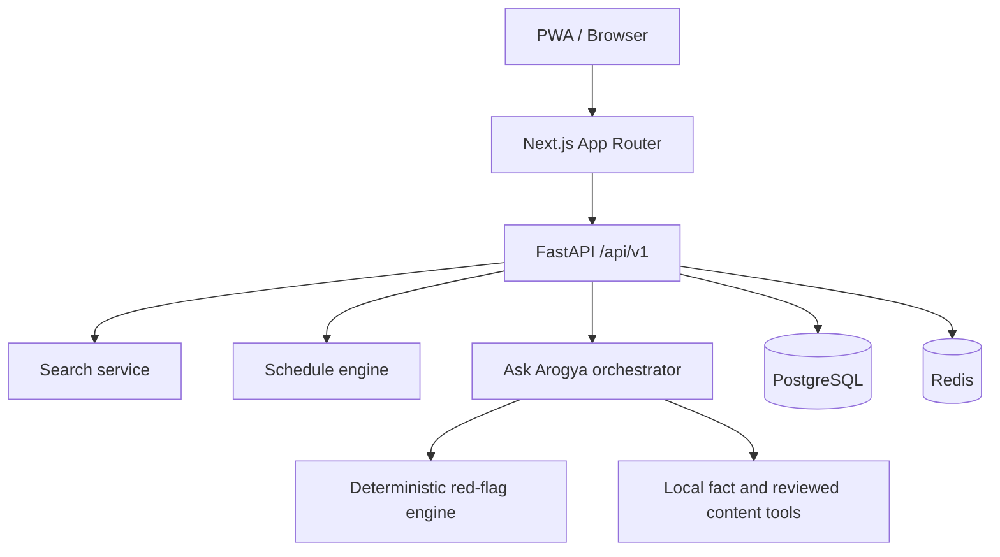

# Pandharkawda Arogya | पांढरकवडा आरोग्य

Pandharkawda Arogya is a bilingual healthcare information and navigation platform for Pandharkawda, Yavatmal District, Maharashtra. It helps residents find verified doctors, facilities, schemes, test-preparation guidance, emergency help, and safe Ask Arogya answers without requiring a public user account.

This repository intentionally uses clearly fictional demo records. It does not publish real doctor contact lists or unverifiable healthcare facts.



## Features

- Public task-first homepage, doctors, visiting doctors, open-now, facilities, public hospital, schemes, tests, procedures, health alerts, saved items, emergency and Ask Arogya routes.
- Admin overview, lists, schedule/session management, verification queue, user reports, audit log, users and settings routes.
- Verification/freshness metadata on healthcare records.
- Deterministic emergency red-flag flow before AI explanation.
- English and Marathi UI strings with no reload language switch.
- Report incorrect information workflow connected to admin queue.
- Demo seed data marked fictional.

## Local Setup

1. Install Node 24+ and Python 3.12+.
2. Copy `.env.example` to `.env` for local secrets.
3. Run `make dev` for Docker, or run API and web separately:
   - `make db-up`
   - `make migrate`
   - `make seed`
   - `make api`
   - `make web`

## Quality Commands

- `make test`
- `make lint`
- `make typecheck`
- `make build`
- `make e2e`

## Local Ollama

Ask Arogya can use local Ollama for optional explanations while still grounding local facts in the API data/tools.

1. Start Ollama locally.
2. Ensure a chat model is available, for example `ollama pull llama3:8b`.
3. Set:

```bash
LLM_PROVIDER=ollama
OLLAMA_BASE_URL=http://localhost:11434
OLLAMA_MODEL=llama3:8b
```

Emergency red flags, local fact lookup, and safety post-checks run before/after the model regardless of provider.

See `docs/` for product, architecture, API, database, safety, testing, deployment, and feature audit details.
