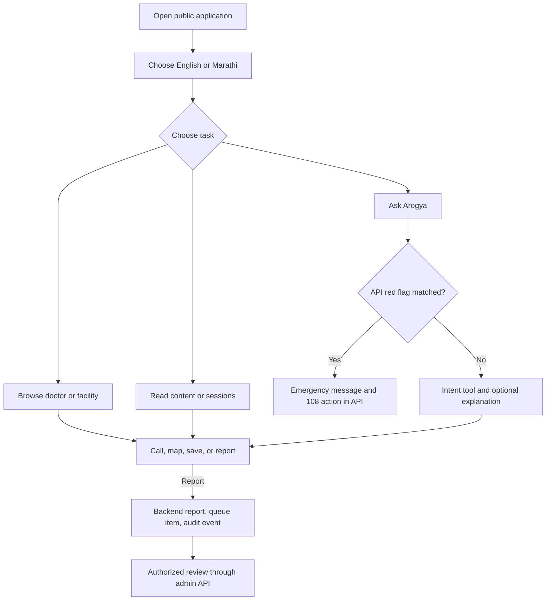
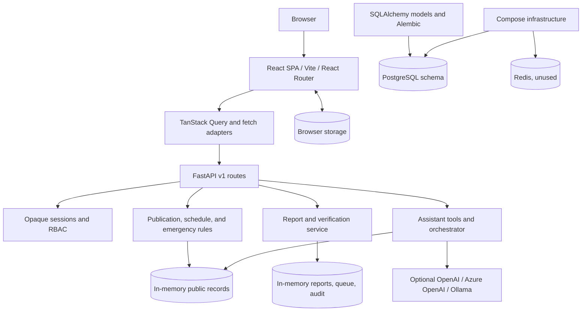
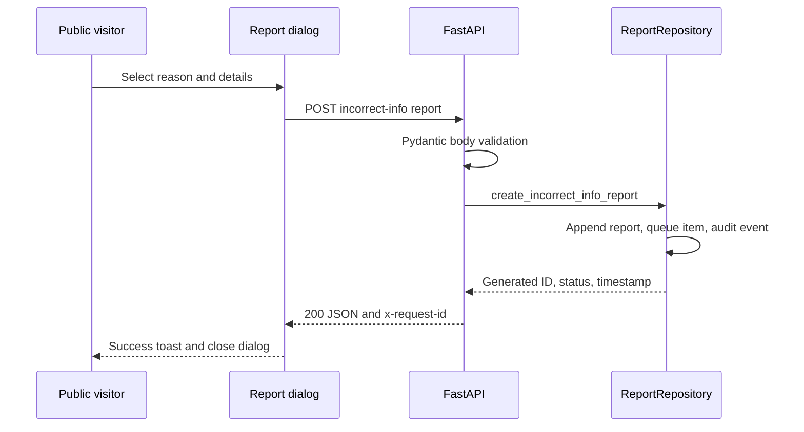
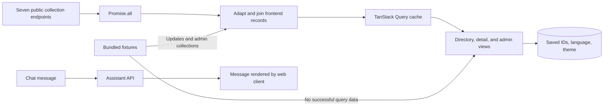
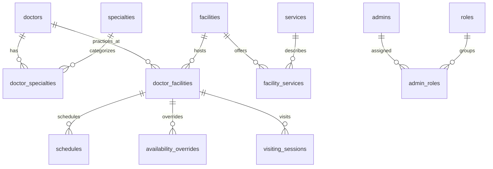
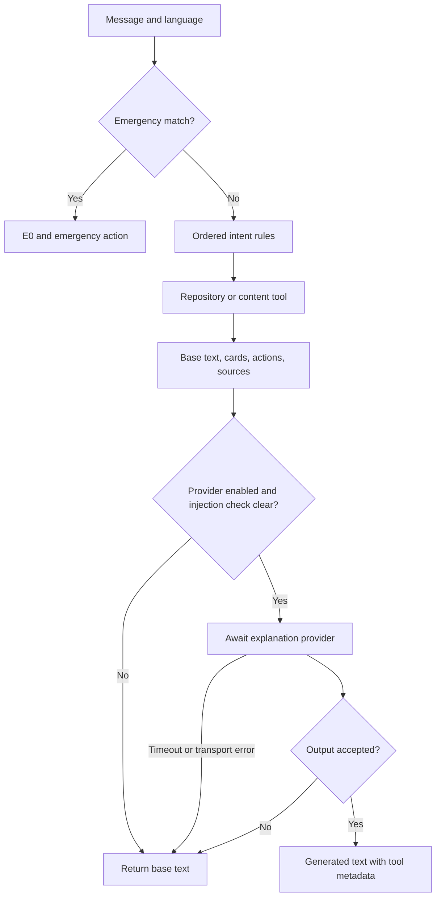
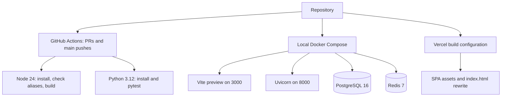
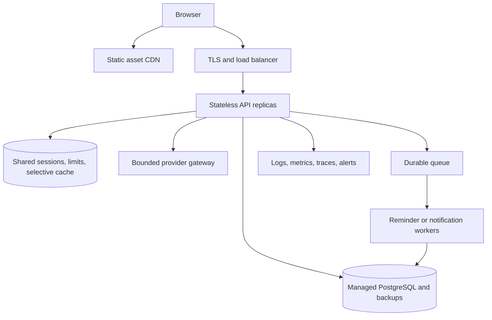

# Pandharkawda Arogya | पांढरकवडा आरोग्य

**Bilingual healthcare navigation for Pandharkawda: local care discovery, verification workflows, and an assistant built around explicit safety rules.**

[](apps/web/package.json)
[](apps/web/package.json)
[](apps/api/pyproject.toml)
[](apps/api/pyproject.toml)

Pandharkawda Arogya helps residents and families explore doctors, facilities, visiting specialists, health information, and emergency contact actions through an English–Marathi interface. Its FastAPI backend combines publication rules, schedule calculations, report review, and optional AI explanations. The central product idea is to make the source, consent, and uncertainty of healthcare information part of the workflow itself.

> **Implementation status:** the public application and selected administrative APIs run with demonstration data. Operational API state lives in memory. PostgreSQL models and an Alembic migration exist, but request handlers do not use them; Redis is provisioned but unused. The application is not a clinical diagnostic system or a verified live healthcare directory.

## Overview

The platform addresses a practical question: **how can someone find appropriate local care without reconstructing the answer from scattered listings, calls, and messages?** Its intended audience includes residents, caregivers, visitors, and maintainers of local healthcare information in Pandharkawda, Yavatmal district, Maharashtra.

The repository contains a React/Vite web application, a Python/FastAPI service, a relational persistence foundation, Docker development infrastructure, and continuous integration. Public browsing requires no account. Administrators have cookie authentication and API permissions for a working report/verification slice.

The strongest implemented elements are:

- publication selectors for verified doctors and facilities;
- doctor phone-consent filtering on directory endpoints;
- timezone-aware backend schedules that separate facility opening from doctor presence;
- public reports that create backend verification and audit records;
- emergency rules that execute before optional model calls;
- interchangeable explanation providers with deterministic fallback;
- bilingual views, local bookmarks, maps, and mobile navigation.

Several boundaries remain unfinished. The open-now screen uses frontend demo rules rather than the schedule endpoint. Admin review screens still use fixtures and toast-only actions. The assistant API returns structured cards, but the successful frontend path renders only its message. These boundaries are documented so contributors can distinguish working modules from complete end-to-end features.

### Contents

- [Problem and solution](#the-problem)
- [Capabilities and roles](#key-features)
- [System architecture](#system-architecture)
- [Database and API](#database-architecture)
- [AI architecture](#ai--machine-learning-architecture)
- [Getting started](#getting-started)
- [Testing](#testing)
- [Security](#security)
- [Deployment and scaling](#deployment-architecture)
- [Limitations and roadmap](#current-limitations)

## The Problem

Healthcare navigation depends on details that change independently: a clinic may be open while a doctor is absent; a visiting specialist may cancel; a number may be private; and an explainer may need review. A static listing rarely makes these distinctions clear.

For a resident or caregiver, fragmented information means repeated calls and uncertainty before travel. For a maintainer, corrections need a destination, an accountable reviewer, and a history of decisions. For a conversational assistant, an unanswered question must not become an invitation to invent a name, number, schedule, or treatment instruction.

The project concentrates on discovery, information freshness, bilingual access, and controlled assistance. It does not implement appointment booking, patient records, diagnosis, prescriptions, payments, or emergency dispatch.

## Our Solution

The interface organizes information around tasks: find a doctor, locate a facility, view visiting sessions, read an explainer, save a listing, report a correction, or ask a question. English and Marathi fields support local-language presentation. Call and map links connect information to a next action.

The API adds domain rules. Its public selectors return doctors and facilities marked `VERIFIED`; directory responses suppress a doctor's phone without publication consent. The schedule module evaluates date overrides before recurring hours in `Asia/Kolkata`. A report creates a report record, review item, and audit event.

Ask Arogya checks emergency patterns first. Otherwise it classifies the question and selects structured records or content. An optional language model can rephrase a base explanation, with pattern-based output checks and fallback on provider failure. The assistant API therefore works with `LLM_PROVIDER=disabled`.

### Product vision

The intended evolution is a maintained local information service supported by institutions and accountable reviewers. That requires real data verification, consent management, durable administration, consistent publication policies, and procedures for corrections.

**Implemented today:** bilingual discovery, demo-backed APIs, deterministic safety/schedule rules, provider adapters, and a backend review workflow.

**Future direction:** persistent institutional workflows, scoped editors, verified imports, review reminders, consented notifications, and offline snapshots. Multi-tenancy, enterprise identity, and external healthcare integrations are proposed extensions.

## Key Features

| Area | What exists | Purpose and boundary |
| --- | --- | --- |
| Doctor discovery | Directory/detail views, specialty/type filters, facility association, call/save/report controls | Find a relevant listing; directory APIs apply publication and phone-consent rules |
| Facility discovery | Directory/detail views, services, Leaflet map, external map links | Connect resources to locations; coordinates and records are demonstration data |
| Visiting specialists | Session views; API excludes cancelled/unconfirmed sessions | Models visits separately; API date cutoff is fixed to September 1, 2026 |
| Opening and presence | Backend weekly schedules, date overrides, separate doctor-availability rule | Avoids equating an open building with available care; UI integration is incomplete |
| Information content | Schemes, tests, procedures, medical terms, health alerts | Bilingual information views with source/review fields; supplied content is illustrative |
| Emergency navigation | Dedicated route, shared sheet, telephone links, backend red-flag response | Shortens navigation to displayed emergency actions; no dispatch integration |
| Ask Arogya | Intent routing, API cards/actions/sources, optional generated explanation | Demonstrates controlled model integration; web success path displays text only |
| Corrections | Public POST creates report, queue item, audit event | Establishes review workflow; dialog sends a display name instead of canonical entity ID |
| Administration | Login, API RBAC, report/queue/audit reads, approve/reject APIs | Working backend slice; most administrative views remain fixture-based |
| Local preferences | Language, theme, saved doctor IDs in browser storage | No public account required; no cross-device synchronization |

### Trust and publication

The backend defines `DRAFT`, `PENDING_VERIFICATION`, `VERIFIED`, `STALE`, `REJECTED`, and `CLOSED`. Doctor and facility selectors publish only verified records. Content routes return their arrays directly rather than applying the same selector.

Directory serialization applies phone consent. The assistant's doctor-card tool currently serializes the full domain doctor, so the consent guarantee does **not** cover chat cards. Centralized public response policy is a priority before introducing real personal data.

## User Roles & Capabilities

Public visitors have no backend identity. Five administrative roles are defined in [rbac.py](apps/api/app/auth/rbac.py):

| Role | Defined permissions | Implemented coverage |
| --- | --- | --- |
| `SUPER_ADMIN` | Wildcard permission | All protected operations |
| `DATA_VERIFIER` | Overview, reports, audit, verification read/decide | Working report/queue/audit API slice |
| `HOSPITAL_EDITOR` | Overview and facility read/write | Facility-specific admin writes absent |
| `MEDICAL_CONTENT_REVIEWER` | Overview and content read/review | Content-review writes absent |
| `ALERT_PUBLISHER` | Overview and alert read/publish | Alert-publication writes absent |

The auth service supplies local demo identities `admin@arogya.local`, `verifier@arogya.local`, and `alerts@arogya.local`. The admin user table in the UI is separate fixture content and is not the authoritative backend permission model.

## How the Platform Works



A visitor does not register. The public-data hook fetches seven collections concurrently and adapts them into UI objects. Pages search/filter those collections and display details. Saved doctor IDs remain on the device.

A correction reaches the backend immediately, but the admin web queue does not read the live verification endpoint. Approving an item through the API updates queue state and appends an audit entry; it does not update the directory record or resolve the original report.

## System Architecture

The implemented architecture is a **client-server application with one modular API process**. React provides a client-rendered SPA. Backend modules organize identity, domain rules, AI, and repositories; route definitions remain in one `main.py`.



There is no runtime API-to-PostgreSQL arrow: migrations and a session factory exist, but endpoint repositories do not use them. Redis has configuration and a container without a consumer. Neither service is needed to exercise the current in-memory API locally.

### Architectural layers

| Layer | Responsibility | Input → output |
| --- | --- | --- |
| Presentation | Routes, cards, maps, forms, translation context | User events → views and HTTP operations |
| Client data | Concurrent fetch, caching, adaptation, demo fallback | JSON collections → frontend types |
| HTTP API | Parsing, dependencies, endpoints, explicit errors | HTTP input → JSON response |
| Domain | Verification selection, time rules, emergency matching | Records and time/text → decisions |
| Review service | Reports, queue decisions, audit events | Submission/decision → process-local state |
| Identity | Argon2, opaque sessions, lockout, permissions | Credentials/cookie → principal or rejection |
| AI | Intent tools, provider abstraction, safety checks | Question/base answer → optional explanation |
| Persistence foundation | ORM tables and async engine/session | Migration metadata → PostgreSQL schema |

### Functional and non-functional requirements

The functional core concerns resource discovery, bilingual information, correction requests, schedule evaluation, and limited navigation questions.

Non-functional priorities visible in code include limiting false certainty, avoiding public-account friction, independently testing domain rules, bounding provider waits, and isolating provider details. Availability, durable consistency, formal accessibility, shared state, and production monitoring remain requirements to implement and measure. No load capacity or uptime target is demonstrated.

## Request Lifecycle

Report submission illustrates an implemented write path:



Middleware accepts or generates a request ID, measures duration, and logs method, URL path, status, and milliseconds. Pydantic validates body structure. Explicit `ApiError` and request-validation failures use custom JSON envelopes; other exceptions have no project-specific normalization.

The dialog requires a selected reason. Backend strings have no minimum/maximum lengths or entity-existence checks. The current UI payload uses `target_type="unknown"` and the displayed name as `target_id`; canonical IDs must be connected before reliable review.

## Data Flow



The public hook uses one `public-data` query key, a 60-second stale time, and one retry. Failure in any of seven requests rejects the aggregate. Until successful data exists, fixtures are supplied, including during loading and initial failure. The hook exposes error/loading fields, but most pages consume only `data`; fallback is not consistently announced as an API failure.

Frontend and API fixtures differ in IDs, counts, names, coordinates, and dates. Some content adapters merge a fixture template into API responses, allowing absent fields to retain demo values. These shortcuts need removal before handling verified real records.

Report side effects happen synchronously. Provider HTTP is awaited asynchronously within chat; it is not a background job. There is no queue worker, freshness scheduler, notification sender, event stream, WebSocket channel, or analytics pipeline.

## Database Architecture

[healthcare.py](apps/api/app/models/healthcare.py) defines 26 SQLAlchemy tables. The initial Alembic revision invokes `Base.metadata.create_all()`; its environment supports async PostgreSQL. [session.py](apps/api/app/db/session.py) configures an async engine with `pool_pre_ping=True` and a session factory that routes do not inject.



The ER diagram shows declared foreign keys rather than inferred links between identifier columns.

| Group | Tables |
| --- | --- |
| Directory | `doctors`, `specialties`, `doctor_specialties`, `facilities`, `doctor_facilities` |
| Services/time | `services`, `facility_services`, `schedules`, `availability_overrides`, `visiting_sessions` |
| Content | `schemes`, `lab_tests`, `procedures`, `knowledge_articles`, `health_alerts` |
| Supporting foundation | `public_health_metrics`, `subscriptions`, `sources` |
| Governance | `incorrect_info_reports`, `verification_requests`, `verification_history`, `audit_logs` |
| Identity | `admins`, `roles`, `permissions`, `admin_roles` |

Keys are strings. Slugs, emails, role names, and permission names have uniqueness constraints. Associations use composite keys or unique pairs. Doctor/facility tables have timestamps and private-note columns; review/audit models provide selected JSON snapshots. No workload-specific secondary indexes, role-permission join table, or general database enum/check enforcement is declared.

ORM and runtime models differ: runtime facilities embed schedules, while SQL schedules belong to doctor–facility associations. Source/freshness fields are not uniform across both representations. Persistence integration requires mapping and schema reconciliation.

### Consistency and transactions

Writes update Python arrays without a transaction or persistent journal. Restarting loses reports, review/audit records, sessions, and login counters. Multiple workers maintain independent copies.

**Recommended for production:** make report, queue, and audit creation transactional; validate targets; enforce verification transitions; derive reviewers from authenticated identity; add concurrency/idempotency controls. Replace model-dependent initial migration behavior with explicit immutable migration operations for future schema evolution.

## API Design

Application routes use `/api/v1`. FastAPI publishes local runtime documentation at `/docs`, `/redoc`, and `/openapi.json`.

| Method | Path | Purpose / access |
| --- | --- | --- |
| GET | `/health`, `/ready` | Static status; no dependency checks |
| GET | `/api/v1/meta` | App/environment/provider/version metadata |
| GET | `/api/v1/search?q=...` | Up to 20 doctor/facility substring matches |
| GET | `/api/v1/doctors` | `specialty` and `doctor_type` filters |
| GET | `/api/v1/doctors/{id_or_slug}` | Consent-filtered public detail |
| GET | `/api/v1/specialties` | Public doctor specialties |
| GET | `/api/v1/visiting-sessions` | Confirmed sessions after fixed demo cutoff |
| GET | `/api/v1/facilities` | Optional `facility_type` filter |
| GET | `/api/v1/facilities/open-now` | Calculated facility/presence fields |
| GET | `/api/v1/facilities/{id_or_slug}` | Detail and trust metadata |
| GET | `/api/v1/emergency` | Configured numbers/messages |
| GET | `/api/v1/schemes`, `/api/v1/lab-tests`, `/api/v1/procedures` | Lists; each also supports `/{slug}` |
| GET | `/api/v1/health-alerts` | Collection; no alert-detail API |
| POST | `/api/v1/chat` | Answer, cards, actions, sources, metadata |
| POST | `/api/v1/reports/incorrect-info` | Public correction |
| POST | `/api/v1/admin/auth/login` | Credentials → cookie |
| POST | `/api/v1/admin/auth/logout` | Authenticated logout |
| GET | `/api/v1/admin/auth/me` | Authenticated identity |
| GET | `/api/v1/admin/overview` | `admin:read`; some counts hardcoded |
| GET | `/api/v1/admin/reports` | `reports:read` |
| GET | `/api/v1/admin/audit-logs` | `audit:read` |
| GET | `/api/v1/admin/verification` | `verification:read` |
| POST | `/api/v1/admin/verification/{item_id}/approve` | `verification:decide` |
| POST | `/api/v1/admin/verification/{item_id}/reject` | `verification:decide` |

Resources commonly use `data` and optional `meta`; search returns `results`, and chat has a task-specific shape. Explicit errors use:

```json
{"error":{"code":"DOCTOR_NOT_FOUND","message":"Doctor not found","details":null}}
```

Current success responses use 200, including writes. Errors include 401, 403, 404, 422, and login-lockout 429. There is no pagination, general sorting, generated TypeScript client, or comprehensive explicit response-model validation.

## Frontend Architecture

[apps/web](apps/web) is the canonical workspace. [App.tsx](apps/web/src/App.tsx) declares React Router routes. [main.tsx](apps/web/src/main.tsx) installs Strict Mode, Query, theme, and toast providers.

Tailwind, Radix-backed primitives, Lucide icons, Leaflet/OpenStreetMap, and reusable cards/sheets/dialogs support presentation. React state handles filters/forms; context handles language/theme; Query handles collections; browser storage holds preferences and saved IDs. Recharts and React Hook Form dependencies/helpers do not imply a finished analytics feature or uniformly validated forms.

Rendering is client-side. There is no Next.js runtime, App Router, Server Components, SSR, SSG, server revalidation, or service worker. `next-themes` is a theme dependency. Routes are eagerly imported. BrowserRouter requires the host to rewrite direct page requests to `index.html`.

<details>
<summary>Route inventory and legacy frontend</summary>

Public routes: `/`, `/doctors`, `/doctors/visiting`, `/doctors/:slug`, `/facilities`, `/facilities/:slug`, `/open-now`, `/schemes`, `/schemes/:slug`, `/tests`, `/tests/:slug`, `/procedures/:slug`, `/medical-explainer`, `/health-alerts`, `/health-alerts/:slug`, `/emergency`, `/ask-arogya`, `/saved`.

Admin: `/admin`, `/admin/login`, and children `doctors`, `specialties`, `facilities`, `schedules`, `visiting-sessions`, `services`, `schemes`, `tests`, `procedures`, `knowledge`, `health-alerts`, `verification`, `reports`, `freshness`, `audit`, `users`, `settings`.

Older docs list standalone `/public-hospital`, `/privacy`, `/accessibility`, `/report-incorrect`, and `/procedures` routes that are not registered. Reports use a dialog.

`frontend/project` is an earlier copy with its own manifest/lockfile and a Supabase client using `VITE_SUPABASE_URL` and `VITE_SUPABASE_ANON_KEY`. It is excluded from root workspaces. Root builds, CI, and current API integration target `apps/web`; Supabase is not part of that runtime path.

</details>

## Backend Architecture

- `core/`: process-environment settings, explicit errors, request logs.
- `auth/`: Argon2, sessions, per-email lockout, permissions, FastAPI dependencies.
- `domain/`: Pydantic records and pure schedule/emergency rules.
- `services/`: demo resources and mutable review state.
- `ai/`: intents, deterministic tools, adapters, safety.
- `models/`, `db/`, `alembic/`: persistence foundation.
- `main.py`: routes and orchestration.

Most handlers are synchronous and operate on memory. Chat is async and awaits HTTPX. No running repository injection, unit-of-work layer, worker, or database startup loader exists. `python -m app.seed` imports demo arrays and prints counts without inserting database rows.

## AI / Machine Learning Architecture

Ask Arogya uses rule-driven retrieval and optional generation. There is no project-trained model, training dataset, feature engineering, embeddings, vector database, fine-tuning pipeline, or evaluation score.

### Problem formulation and grounding

Ordered English/Marathi keyword rules select doctor, visiting-specialist, open-now, facility, service, test, procedure, scheme, term, or alert tools. Unknown questions receive an insufficient-information message and directory action.

Tools read demo records or the first content item in a collection. Doctor filtering recognizes selected specialties; service matching is broad. Source labels such as `local_database` name an intended provenance category, while actual storage is an in-memory list.



### Provider boundary

[providers.py](apps/api/app/ai/providers.py) defines a protocol and request/response dataclasses. OpenAI and Azure adapters use chat-completions HTTP, temperature `0.2`, and 20-second timeouts. Ollama uses `/api/chat`, no streaming, and 30 seconds. Each call creates an HTTPX async client.

The system prompt prohibits inventing local names, numbers, schedules, eligibility, diagnoses, or doses. The provider receives the user question and a **base explanation string**, not the complete card payload. The language field is not explicitly applied by outbound adapters, so generated-language fidelity is not guaranteed.

### Safety, explainability, and limits

Emergency patterns run before intent routing and avoid model calls. Separate regex checks catch some injection phrases, unsafe directives, overconfident fasting statements, and unsourced local facts. Rejected output or exceptions preserve the base answer.

Sources, intent labels, cards, and rule names make deterministic routing inspectable. They are not calibrated confidence scores. The `grounded` flag is set by application logic; the safety check's `has_sources` argument compares a particular base-text string rather than the actual source list. Neither proves that every generated assertion is supported.

There is no model registry, prompt-version store, inference audit, SHAP/LIME, clinician-approved evaluation corpus, or performance metric. Regex rules have language/paraphrase gaps and ordered intents can misclassify multi-topic questions. Future evaluation should cover reviewed bilingual cases, emergency false negatives, factuality, all-path consent checks, and adversarial inputs. Current tests establish selected behavior, not clinical validation.

## Technology Stack

Versions below are manifest constraints or image tags, not exact resolved versions for every installation.

| Layer | Declaration | Purpose |
| --- | --- | --- |
| UI | React / React DOM `^19.2.4` | Rendering |
| Build | Vite `^8.2.2`, TypeScript `~5.9.3` | Build and typing |
| Routing/data | React Router DOM `^7.18.3`, Query `^5.102.8` | Routes and cache |
| Styling | Tailwind `^4.2.1`, Vite plugin `^4.3.3`, Radix `^1.4.3` | Styling/primitives |
| Maps | Leaflet `^1.9.4` | OpenStreetMap display |
| API | FastAPI `>=0.115`, Uvicorn `>=0.30`, Pydantic `>=2.8` | HTTP/validation |
| Data foundation | SQLAlchemy `>=2.0`, asyncpg `>=0.29`, Alembic `>=1.13` | ORM/driver/migrations |
| Identity | argon2-cffi `>=23.1` | Password verification |
| HTTP | HTTPX `>=0.27` | Provider requests |
| Testing | pytest `>=8.2`, pytest-asyncio `>=0.23` | Backend dependencies |
| Containers | PostgreSQL `16-alpine`, Redis `7-alpine` | Local infrastructure |
| Runtime/CI | Python `>=3.12`; CI Node 24 / Python 3.12 | Declared execution environment |

### Why this stack? Engineering trade-offs

These explanations describe the fit of implemented choices, not an undocumented historical decision process.

| Choice | Fit | Cost |
| --- | --- | --- |
| React SPA + Vite | Interactive directory and static artifact | JavaScript-dependent first render and SEO |
| FastAPI + Pydantic | Validation, dependencies, docs, async HTTP | Route/response organization must mature |
| Relational target schema | Associations and transactional review needs | ORM/domain mapping remains unfinished |
| Modular monolith | Simple development and domain testing | Process-local state prevents replication |
| REST | Direct resource/action endpoints | Inconsistent envelopes and collection overfetching |
| Opaque sessions | Expiry and revocation | Shared storage, CORS/cookies, CSRF need work |
| Tools before generation | Deterministic usefulness without credentials | Limited rule coverage and maintenance |
| Query + local state | Small state-management surface | One aggregate cache key couples failures |
| Browser bookmarks | No public identity system | No cross-device recovery |

[Decision notes](docs/DECISIONS.md) explicitly favor fictional records, coordinates instead of advanced spatial queries, and disabled-by-default generation. Other documents sometimes describe intended behavior beyond the current implementation.

## Getting Started

### Prerequisites and installation

Use Node.js 24, matching CI, and Python 3.12+, matching the package declaration/container. Docker is optional for the current in-memory API and needed for the migration or full Compose workflow. Ollama is optional.

```bash
git clone https://github.com/Payoshnee/PANDHARKAWDA-AROGYA.git
cd PANDHARKAWDA-AROGYA
npm ci
python3.12 -m venv .venv
source .venv/bin/activate
python -m pip install ./apps/api
```

The activation command is for a POSIX shell. Run from the repository root unless a block changes directories.

### API terminal

```bash
cd apps/api
LLM_PROVIDER=disabled python -m uvicorn app.main:app --reload --port 8000
```

### Frontend terminal

In a second terminal at the root:

```bash
VITE_API_BASE_URL=http://localhost:8000 npm --workspace apps/web run dev -- --port 3000
```

Open `http://localhost:3000`; API docs are at `http://localhost:8000/docs`. Explicit port 3000 matches the API's default CORS origin. Plain `make web` uses Vite's default port, usually 5173.

### Environment files

```bash
cp .env.example .env
```

The backend reads `os.getenv` and does **not** automatically load this file. Export needed values before launch. Frontend env files belong under `apps/web` unless loaded externally. `VITE_*` values ship to browsers; never put provider secrets there.

Compose explicitly uses `.env.example` as its API env file, not the copied `.env`. It overrides database/Redis URLs with container hostnames.

### Optional database schema

```bash
docker compose up -d postgres redis
cd apps/api
alembic upgrade head
python -m app.seed
```

Local defaults match `.env.example`. Migration creates the PostgreSQL schema; the seed command prints fixture counts. Neither changes the HTTP repository implementation.

### Container workflow

```bash
docker compose up --build
```

Services expose web 3000, API 8000, PostgreSQL 5432, and Redis 6379. No named database volume, automated migrations, TLS, or API dependency-readiness check is configured. The web image uses Vite preview and installs independently without the root lockfile.

### macOS launcher and admin access

`./start.sh` opens services in macOS Terminal and optionally starts Docker/Ollama. It defaults to Ollama; `LLM_PROVIDER=disabled ./start.sh` selects deterministic mode. `./stop.sh` stops tracked processes and the two Compose data services. Logs live in `.run/logs`.

Demo identities and the local-only shared test password are defined in [auth/service.py](apps/api/app/auth/service.py) and tests. Prefilled UI login values do not match them. No environment variable replaces the demo password.

Separate-origin browser login also needs CORS repair: fetch includes credentials, but API middleware does not enable `allow_credentials=True`. Same-origin API tests do not validate that browser behavior.

## Environment Configuration

| Variable | When needed | Behavior |
| --- | --- | --- |
| `ENVIRONMENT` | Metadata / production cookie | Default development; production sets Secure cookie |
| `DATABASE_URL` | Migration/foundation | Local PostgreSQL async default; endpoints do not use it |
| `REDIS_URL` | Reserved | No consumer |
| `ADMIN_SESSION_COOKIE` | Optional | Default `arogya_admin` |
| `CORS_ORIGINS` | Browser access | Comma-separated; default localhost:3000 |
| `LLM_PROVIDER` | Optional AI | disabled/openai/azure_openai/ollama |
| `OPENAI_API_KEY` | OpenAI | Missing key falls back to disabled |
| `OPENAI_MODEL` | OpenAI | Code default `gpt-4.1-mini` |
| `AZURE_OPENAI_API_KEY` | Azure | Required with endpoint/deployment |
| `AZURE_OPENAI_ENDPOINT` | Azure | Resource URL |
| `AZURE_OPENAI_DEPLOYMENT` | Azure | Deployment name |
| `AZURE_OPENAI_API_VERSION` | Azure | Code default `2024-10-21` |
| `OLLAMA_BASE_URL` | Ollama | Default localhost:11434 |
| `OLLAMA_MODEL` | Ollama | Code default `llama3.1`; sample/launcher `llama3:8b` |
| `VITE_API_BASE_URL` | Web | Default localhost:8000; build-time value |
| `NEXT_PUBLIC_API_BASE_URL` | Launcher compatibility | Not read by Vite source |
| `API_PORT`, `WEB_PORT` | Launcher | Default 8000/3000 |
| `JWT_SECRET` | Unused | Authentication uses opaque sessions |

Empty values override defaults. Fill or omit the sample's empty model/API-version fields when enabling their provider. Settings are read at process startup; restart after changes. The legacy frontend separately reads `VITE_SUPABASE_URL` and `VITE_SUPABASE_ANON_KEY`.

### Local inference

With Ollama installed:

```bash
ollama pull llama3:8b
ollama serve
```

Start the API from `apps/api`:

```bash
LLM_PROVIDER=ollama OLLAMA_MODEL=llama3:8b python -m uvicorn app.main:app --port 8000
```

`bash scripts/ollama-smoke.sh` is a direct connectivity check, not an application evaluation. Inside a container, localhost means that container; configure a reachable provider endpoint. Model names here reflect repository defaults, not verified current provider availability.

## Testing

```bash
npm run build
cd apps/api
LLM_PROVIDER=disabled python -m pytest
```

There are 36 backend tests:

| File | Coverage |
| --- | --- |
| `test_ai_providers.py` | Provider selection and missing-credential fallback |
| `test_ai_safety.py` | Selected injection/unsafe-output checks and provider failure fallback |
| `test_safety_and_public_api.py` | Emergency/intents, public filtering, directory consent, schedules, auth/RBAC/lockout, report/review endpoints |

Tests use in-memory state and fake provider behavior. They do not establish live-provider quality, migrations, browser integration, load capacity, or clinical correctness. No frontend component/browser/database integration suite is checked in.

`npm test`, `npm run lint`, and `npm run typecheck` all invoke `tsc --noEmit`. The web root TypeScript config has `files: []` and references, so these aliases should not be treated as full referenced-project validation. `npm run build` runs `tsc -b` before Vite.

`make test` chains that frontend alias and pytest. `make e2e` refers to an undefined npm script. Earlier docs describe browser tests that are absent.

### Documentation verification

During this README audit, `npm run build` passed with a warning about a JavaScript chunk exceeding 500 kB. All 36 backend tests passed with `LLM_PROVIDER=disabled` using the workspace's existing Python 3.9.6 environment. That test result does not replace validation on the declared Python 3.12 runtime; Python 3.12 was unavailable locally. Docker image builds, database migrations, fresh dependency installation, live model calls, and browser flows were not executed as part of this documentation change.

## Security

### Implemented controls

Argon2 verifies admin passwords. Login creates a random opaque token with a 30-minute session stored in memory, sent in an HTTP-only, SameSite=Lax cookie. Five failed attempts for an email trigger a ten-minute lockout; logout revokes the token. Protected routes resolve sessions and check permissions.

```mermaid
sequenceDiagram
    participant Client as API client
    participant API as Authentication routes
    participant Auth as In-memory AuthService
    Client->>API: Email and password
    API->>Auth: Check lockout and Argon2 password
    alt Valid credentials
        Auth->>Auth: Generate token and 30-minute session
        API-->>Client: HTTP-only cookie
        Client->>API: Protected request
        API->>Auth: Resolve token and permissions
        API-->>Client: Result or 401/403
    else Invalid credentials
        Auth->>Auth: Increment failure count
        API-->>Client: 401; locked requests receive 429
    end
```

Pydantic validates request shapes; directory APIs filter unverified records and non-consented numbers. ORM mappings exist, but no live SQL request path is implemented.

### Production security recommendations

Replace hardcoded identities, share sessions/lockouts, repair credentialed CORS/cookie topology, add CSRF controls and admin route guards, and centralize public serialization. Derive audit reviewers from authenticated identity rather than the body-provided `verifier`.

Reports/chat lack size limits and general throttling. Leaflet popups interpolate record text as HTML, requiring safe DOM construction or sanitization before accepting untrusted content. Audit arrays are mutable and volatile. TLS termination, security headers, secret management, and scoped institutional access remain deployment work.

## Reliability & Fault Handling

| Failure / edge | Current behavior | Evolution needed |
| --- | --- | --- |
| Public collection fails | Aggregate query fails; fixtures if no successful data | Separate queries and explicit provenance/errors |
| API chat unavailable | Browser keyword-based demo response | Unified fallback/safety behavior |
| Provider timeout/rejection | Backend base answer returned | Stronger validation and latency metrics |
| API restart | Mutable state and sessions lost | Durable repositories/shared sessions |
| Database failure | Endpoints continue using memory | Dependency readiness after integration |
| Repeated review decision | State overwritten, audit event appended | Transition/concurrency policy |
| Network offline | Connectivity banner | Offline snapshot/retry design |

Schedule intervals use inclusive comparisons; overrides take priority. Overnight blocks are not modeled across midnight. Doctor availability requires an open facility and presence/session evidence; current callers pass both presence inputs as false. Visiting selection uses a fixed date.

There are no transaction retries, idempotency keys, backup jobs, or restore tests.

## Logging, Monitoring & Observability

Middleware emits request ID, method, path, status, and duration JSON, and returns `x-request-id`. It does not log in a `finally` block for all unhandled failures.

Health/readiness endpoints are static. Compose checks PostgreSQL and Redis. No metric exporter, log aggregation, tracing, error tracker, usage analytics, AI accounting, or operational monitoring is integrated. Admin display counts are not production telemetry.

**Recommended:** measure errors/latency, provider fallback, review backlog, and data age; add actionable alerts and dependency checks. Prefer correlation IDs and aggregates over collecting raw health questions.

## Deployment Architecture



The API image uses Python 3.12 slim; web uses Node 22 Alpine. Compose waits for healthy data services before API startup and an API process before web startup. It does not migrate or prove dependency-aware API readiness.

Vercel configuration describes static hosting. Root build copies web output to root `dist`, while root Vercel points to `apps/web/dist`. It does not deploy Python, and no verified live demo URL is recorded here.

Set `VITE_API_BASE_URL` before building. Runtime container variables do not rewrite already-built assets. Separate-origin admin hosting requires the integration work above.

### DevOps & CI/CD

[ci.yml](.github/workflows/ci.yml) runs web/API jobs on PRs and main pushes. There is no release/deploy job, container-build test, migration test, vulnerability scan, browser suite, or rollback automation. Python dependencies are minimum versions without a lockfile; container web installation does not use the root lockfile.

Future delivery should test a fresh migration, produce versioned artifacts, exercise browser/API integration, and support rollback. These are proposed operations, not current cloud infrastructure.

## Scalability & Performance

### Current implementation

Static web assets can be hosted separately. Collections fetch in parallel and remain fresh in Query for one minute. Provider HTTP is async. There are no measured load results.

Constraints include process-local state, linear searches, unpaginated collections, coupled aggregate fetching, eager imports, and provider waits. Replicas cannot share reports or sessions. Redis caching, live database query optimization, read replicas, and workers are not active features.

### Scaling to production

These are planning scenarios, not measured capacity claims; request rate and workload matter more than user count.

| Scenario | Proposed priority |
| --- | --- |
| Around 100 users | Safe serialization, persistence, real data ownership, browser integration, backups |
| Around 1,000 users | Pagination, measured indexes, shared sessions/limits, latency/error baselines |
| Around 10,000 users | Stateless replicas, bounded DB pools, selective cache/invalidation, isolated inference, justified background jobs |
| 100,000+ users | Capacity testing, geographic/tenant scoping, search/read replicas when needed, multi-zone availability, recovery drills |

Shared durable state is a prerequisite to horizontal scaling. Add cache layers after profiling. Availability data needs short validity windows and explicit timestamps, because generic caching can make it less trustworthy.

### Production-scale architecture — proposed



This is a possible evolution. Managed services, replica infrastructure, and workers are not provisioned by this repository.

## Accessibility & User Experience

The app includes responsive layouts, mobile navigation, bilingual fields, persisted preferences, semantic call/map links, labelled reporting controls, and reusable state components. Radix primitives support dialog/focus behavior; icons often accompany text.

There is no formal accessibility certification, automated accessibility suite, screen-reader test record, or verified contrast/touch-target audit. Initial persisted-language/document synchronization warrants testing; document language is set when the user changes it. Offline detection only reflects browser connectivity and does not guarantee cached pages or map tiles.

## What Makes This Project Different?

The domain combines verification, contact consent, recurring/exceptional schedules, visiting-session state, correction review, and optional generation. Each affects how information becomes a public action. That creates a richer engineering problem than storing and editing rows.

The deterministic assistant path also makes controlled AI adoption testable: provider selection/failure handling are isolated from resource-selection rules. Remaining gaps identify where public boundaries need stronger enforcement.

### How it stands apart

This compares approaches conceptually, not named competitors or researched market offerings.

| Approach | Strength | Added design in this repository |
| --- | --- | --- |
| Static listing | Simple directory access | Status/consent rules and visit/schedule models |
| Informal calls/messages | Human confirmation | Shared discovery and correction queue foundation |
| Unconstrained chat | Flexible questions | Intent tools, emergency branch, optional generation |

## Real-World Impact and Productization

With verified data and completed integrations, residents could spend less effort finding contacts, caregivers could read in a preferred language, and maintainers could handle corrections consistently. These are intended benefits; no adoption, time-savings, clinical outcomes, or institutional deployment is claimed.

Productization begins with ownership: who confirms records, publishes them, records consent, defines staleness, and corrects mistakes? Durable institutional permissions and review operations precede later SaaS/tenant, billing, SSO, partner API, and notification ideas. Supporting schema tables alone do not implement those products.

## Key Engineering Challenges and Learnings

| Challenge | Implemented approach | Lesson / next step |
| --- | --- | --- |
| Accurate availability | Pure IST rules and separate presence | Unify frontend/backend sources |
| Controlled publication | Verified selectors and directory redaction | Share policy across every output |
| Optional AI | Provider protocol, base text, checks | Evaluate factual trust separately from provider success |
| Correction history | Report → queue → audit operations | Add persistence, transactions, identity, state rules |
| Different data shapes | TypeScript adaptation and joins | Explicit missing values/generated contracts avoid fixture leakage |
| Bilingual experience | Translation context and paired fields | Language must cover providers, errors, and document state |

### Technical topics demonstrated

React composition/routing, client caching, REST validation, permission dependencies, cookie sessions, hashing, relational associations, domain modeling, timezones, state transitions, async I/O, provider abstraction, deterministic fallback, Docker, and CI are supported by the source.

Distributed consistency, large-scale database operations, trained-model evaluation, and production incident response are future design discussions rather than completed demonstrations.

### Research potential

Potential experiments include bilingual intent classification, emergency false negatives, explanation factuality, stale-information presentation, and review turnaround. These require reviewed datasets, reproducible measurement, error categories, and language-specific reporting. No benchmark or clinical study is claimed.

## Current Limitations

- API state is volatile; PostgreSQL/Redis do not power resource workflows.
- API/frontend fixtures differ, including realistic-looking names and generated freshness dates.
- Open-now UI uses browser-local fixture rules; backend uses IST schedules and different IDs.
- Visiting cutoff is fixed; current doctor-presence inputs are false.
- Chat cards bypass directory phone redaction; web success path omits cards/actions/sources.
- AI grounding flags and regex checks do not prove clinical safety or factual support.
- Admin views lack guards and mostly use fixtures; cross-origin login requires repair.
- Report dialog loses canonical target IDs; approval does not update directory/report state.
- API-to-UI fields can inherit demonstration templates.
- Durable audit, database/browser tests, production readiness, and deployment automation are absent.

## Roadmap

### Phase 1 — Existing foundation

- [x] English/Marathi React application and public navigation
- [x] Public and selected administrative APIs
- [x] Backend verified selectors and directory phone filtering
- [x] Schedule rules and emergency matching
- [x] OpenAI, Azure, and Ollama adapters
- [x] Backend report/review/audit workflow tests
- [x] ORM schema, migration, Compose, and CI

### Phase 2 — Complete application paths

- [ ] Apply consent/publication policy to every response
- [ ] Connect availability, review, search, and chat-card UI to authoritative APIs
- [ ] Repair report IDs, CORS/session integration, guards, and reviewer identity
- [ ] Replace fixed dates and fixture-derived factual fields
- [ ] Add browser/contract tests and reconcile legacy frontend

### Phase 3 — Durable governance

- [ ] Transactional PostgreSQL repositories and persistent identity
- [ ] Reconciled models and explicit migrations
- [ ] Review concurrency/state policy, consent records, backups
- [ ] Verified imports and accountable bilingual review

### Phase 4 — Operations and scale

- [ ] Shared limits, measured caching, readiness, monitoring
- [ ] Multilingual AI evaluation and factuality validation
- [ ] Release/rollback automation and restore tests
- [ ] Accessibility and low-bandwidth validation
- [ ] Scoped institutional deployments and consented notifications

## Repository Structure

```text
.
├── .github/workflows/ci.yml
├── apps/
│   ├── api/
│   │   ├── app/
│   │   │   ├── ai/                # Intents, tools, providers, safety
│   │   │   ├── auth/              # Sessions, dependencies, RBAC
│   │   │   ├── core/              # Config, errors, request logs
│   │   │   ├── db/                # Async SQLAlchemy foundation
│   │   │   ├── domain/            # Records, schedules, red flags
│   │   │   ├── models/            # ORM tables
│   │   │   ├── services/          # In-memory resources/review
│   │   │   ├── tests/
│   │   │   ├── main.py
│   │   │   └── seed.py
│   │   ├── alembic/
│   │   ├── Dockerfile
│   │   └── pyproject.toml
│   └── web/
│       ├── src/
│       │   ├── components/        # Admin, shared domain, primitives
│       │   ├── hooks/
│       │   ├── lib/               # API, i18n, fixtures, utilities
│       │   ├── pages/
│       │   ├── types/
│       │   ├── App.tsx
│       │   └── main.tsx
│       ├── Dockerfile
│       ├── package.json
│       ├── vite.config.ts
│       └── vercel.json
├── frontend/project/              # Earlier standalone copy
├── packages/types/                # Status unions, not generated client
├── docs/                          # Product/design/implementation notes
├── scripts/ollama-smoke.sh
├── .env.example
├── docker-compose.yml
├── Makefile
├── start.sh
├── stop.sh
├── package.json
├── package-lock.json
└── vercel.json
```

## Screenshots and Demo

No application screenshots or verified hosted demo link are included. Use [Getting Started](#getting-started) and local `/docs` to explore the app and API.

<!-- Add real captures of bilingual home, directory detail, availability, assistant, and verification UI. Label demo data and display-only interactions. -->

## Contributing

1. Fork and create a focused branch.
2. Implement current frontend changes in `apps/web`; explain any legacy-copy changes.
3. Keep fixtures illustrative; do not commit credentials or personal healthcare data.
4. Run `npm run build` and backend pytest; test changed domain/API behavior.
5. Describe contract, safety/publication, and validation changes in the pull request.

Useful references: [product intent](docs/PRODUCT_SPEC.md), [design system](docs/DESIGN_SYSTEM.md), [decisions](docs/DECISIONS.md), and [implementation tracker](docs/task.md). Some older architecture/testing/deployment notes retain stale claims; use executable code and the integration boundaries here as the current reference.

## Team

Git history records contributions under **Payoshnee**. No additional team roles or roster are declared here.

## License

No open-source license has currently been declared.

---

Pandharkawda Arogya brings discovery, verification, time-aware information, and controlled AI assistance into one local healthcare navigation design. Its next milestone is completing the data and review paths so each public answer can be tied to a durable record, a clear publication policy, and an accountable source.
