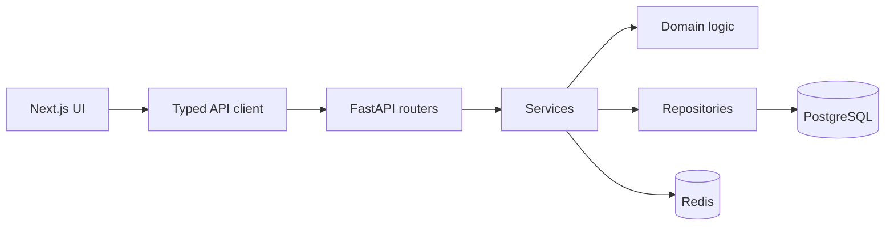

# Architecture

The project is a monorepo with `apps/web` for Next.js, `apps/api` for FastAPI, shared TypeScript contracts in `packages/types`, docs, scripts, and Docker development infrastructure.

The backend uses layered modules: routers call services, services call repositories/domain utilities, and domain logic such as schedule calculation and red-flag detection is unit tested outside route handlers.

